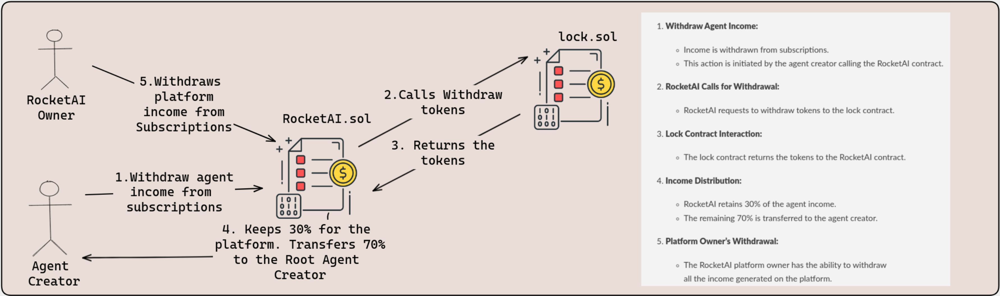

# Welcome to RocketAI Platform 🚀🧑‍🚀⚛

  

## Short Description Pitch🎤

***RocketAI*** blends web3 with OpenAI innovations for a new era in AI agent creation featuring a decentralized incentive system that rewards excellence with RAI tokens via Chainlink Automation & Functions.

## Description📜

**RocketAI** is a comprehensive platform for creating, fine-tuning, and engaging with specialized AI agents. By integrating OpenAI's GPT models with blockchain technology, it offers a unique blend of AI intelligence and decentralized functionality. Creators can design agents with specific skills, users can subscribe to these agents, and fine-tuners can enhance them, creating a collaborative and evolving AI environment.

## A Submission for the Chainlink Constellation Hackathon 2023.

**Authors:**

- [Dhruv-2003](https://github.com/Dhruv-2003)
- [Architsharma7](https://github.com/Architsharma7)
- [nijoe1](https://github.com/nijoe1)

## Flow & Architecture of the Application✨

### Agent Creation Process

Creators use OpenAI GPT models to design AI agents, specifying their intended context and functionality. This can range from language understanding and code interpretation to complex file analysis. The agents are then deployed on the blockchain, ensuring secure storage and execution of their logic.

### Fine-Tuning Workflow

Fine-tuners, or contributors, can select existing agents to enhance. Based on the initial configurations set by creators, they can improve the agent's capabilities or add new features. This process not only improves the quality of the agent but also allows fine-tuners to share in the revenue generated from subscriptions.

### User Interaction Flow

Users browse the platform to find agents that fit their needs. They can filter agents by category or function and subscribe to them using the Unlock Protocol. Once subscribed, users can interact with the agents for various tasks, providing valuable feedback for further improvements.

### Subscription and Feedback System

Subscriptions are managed through the Unlock Protocol, which handles the logistics of user access to different AI agents. User feedback is a crucial component, as it guides creators and fine-tuners in refining and enhancing the AI agents.

## RocketAI Incentive Mechanisms and Chainlink Integration

### Overview

RocketAI leverages a hybrid system combining Chainlink Time-Based Automation, Chainlink Functions, and Chainlink Log Trigger Automation to incentivize agent creators and top users.

### Revenue and Fee Structure

- **Agent Creators:** Earn from subscriptions to their agents.
- **Contributors:** Pay fees for fine-tuning models based on main agent subscriptions.

## Chainlink Integration

- **Time-Based Automation:** Regularly initiates the reward process on a set schedule (e.g., monthly).
- **Chainlink Functions:** Query the RocketAI server for top-performing agents or users, and stores them on-chain
- **Log Trigger Automation:** Listens for contract events post-query fulfillment to trigger the reward distribution.

### Rewards Distribution

- **Top Agent Creators:** Rewarded based on agent performance and user ratings within the platform.
- **Top Users:** Incentivized through engagement metrics like subscription levels.
- **Modular Design:** Supports various reward structures, adaptable to different market needs and use cases.
- **Diverse Rewards:** Includes scenarios like top-performing agents in specific campaigns (e.g., Twitter ads) or general platform engagement.

### Outcome

- **Quality Enhancement:** Motivates the creation of superior agents.
- **User Engagement:** Encourages active participation and subscription growth.
- **Adaptability:** Flexible to incorporate diverse rewarding strategies.

The integration of Chainlink's diverse automation and function capabilities with RocketAI's modular reward system establishes a robust, dynamic, and equitable environment for all platform participants.

## Architecture Diagrams

  
Architecture Diagrams

  
  ### Agents Creation

  
  
  
  ### Agents Subscription

  

### Reward Mechanism

  

### Platform and Agents Creators Income

  

## 🧑‍💻Technologies Used 🤖

### OpenAI 🔮

**OpenAI APIs**: The core AI engine of the platform. OpenAI's GPT models provide the foundational intelligence for the agents. Creators can parameterize these models for a wide range of tasks, like natural language processing, image generation  Creating Advertasments and more.

### Chainlink Protocol 💎

**Chainlink Protocol**: A critical component for integrating external data into the platform. Chainlink's decentralized oracle network enables the platform to securely and reliably bring in outside data, which is essential for automating the reward distribution process based on agents' performance and user feedback and engagement.

- TimeBased Automation keeper
  - [Keeper Best agent Ads creations Rewarding](https://automation.chain.link/mumbai/86997237276821682881210219114699384568045110504626347985217584324485942472134)
  - [Keeper Most Active users Rewarding](https://automation.chain.link/mumbai/20865975940877883507250379394801837877800838813677926648707710558950748534139)
  - [Keeper Ratings-Based agent Rewarding](https://automation.chain.link/mumbai/74144283878379645637176867477229354984663197323006917592696664999426381820156)
- Chainlink Functions
  - [Subscription link Avalanche](https://functions.chain.link/avalanche/14)
  - [Subscription link Mumbai](https://functions.chain.link/mumbai/785)
  - [SmartContract Chainlink Consumer](https://github.com/Architsharma7/Constellation/blob/main/contracts/contracts/ChainlinkConsumer.sol)
- Log Triger Automation Keeper
  - [Keeper url](https://automation.chain.link/mumbai/75326241586280970289773533163079124194315874650874194249875686483698062817946)

### TheGraph 🕸️

**The Graph** is used to index user interactions and contract events on the blockchain. It ensures that the platform's interface remains informative and user-friendly by providing quick access to data about agent interactions, subscriptions, and overall platform activity.

- [RocketAI(Subgraph Code)](https://github.com/Architsharma7/Constellation/tree/main/subgraph)
- [RocketAI(Subgraph Avalanche)](https://testnet.thegraph.com/explorer/subgraphs/F7X9FvGzzzucrVbArY8yJhK7VZTEXCTzgogWnmsMznko?view=Overview&chain=sepolia)
- [RocketAI(Subgraph Mumbai)](https://testnet.thegraph.com/explorer/subgraphs/E6ErCGzMQiiuNfJhwqriihGxhoc4YRBEQjEFx4c8fof6?view=Overview&chain=sepolia)

- Usage of the existing Unlock Protocol Subgraph on **Avalanche Mainnet** & **Polygon Mumbai**

### Unlock Protocol 🔓

**Unlock Protocol**: This protocol manages the subscription mechanics on the platform. It allows users to seamlessly subscribe to different AI agents, handling the access permissions and subscription durations. This integration ensures a smooth and secure transactional experience for users engaging with the agents but also acts as a revenue stream for agent creators, contributors and to our platform for a sustainable decentralized economy.

## Smart Contracts

The RocketAI platform is deployed on the following blockchains:

- **Avalanche Mainnet**: [Snowtrace Contract Link](https://avalanche.routescan.io/address/0x3fDfb0F7b1f17d39DD5e326A929541Cd2C0Cbc36#code)
- **Polygon Mumbai Testnet**: [Mumbaiscan Contract Link](https://mumbai.polygonscan.com/address/0xBd1767206D13601f162cd18eA006B798775f798b)

### Conclusion and Future Plans 🚀🌐

**RocketAI** focuses on fostering a dynamic AI ecosystem, emphasizing both creator innovation and user engagement. The platform's incentive layer and economy are built around a versatile reward system that benefits both AI agent creators and users.
- Add more agent actions and tools.

#### Key Elements:

- **Revenue Model:** The platform sustains itself through a portion of subscription fees, while the remainder supports creators and users with revenue and **RAI** ERC20 tokens.
- **Chainlink Integration:** Utilizes Chainlink's Time-Based Automation in conjunction with Function and Log Trigger Automation. This setup ensures regular, automated reward distributions based on performance metrics and user engagement.
- **Reward Distribution:** Rewards are tailored to various categories, including top agent creators and active users, aligning with the platform's emphasis on quality and participation.
- **Modular Reward System:** Designed to accommodate diverse reward structures, it can adapt to different market needs and use cases, such as rewarding top-performing agents in specific campaigns or based on overall platform engagement.

### Future Ambitions:

Post-hackathon, RocketAI aims to enhance the **RAI** token's economy, further incentivizing innovation and engagement. The goal is to cultivate a robust, equitable platform that rewards excellence and active participation, setting a new standard in the AI and blockchain space.

This strategic approach not only incentivizes quality and innovation but also ensures a sustainable and expanding ecosystem, fueling RocketAI's vision of becoming a leading force in AI and blockchain integration.